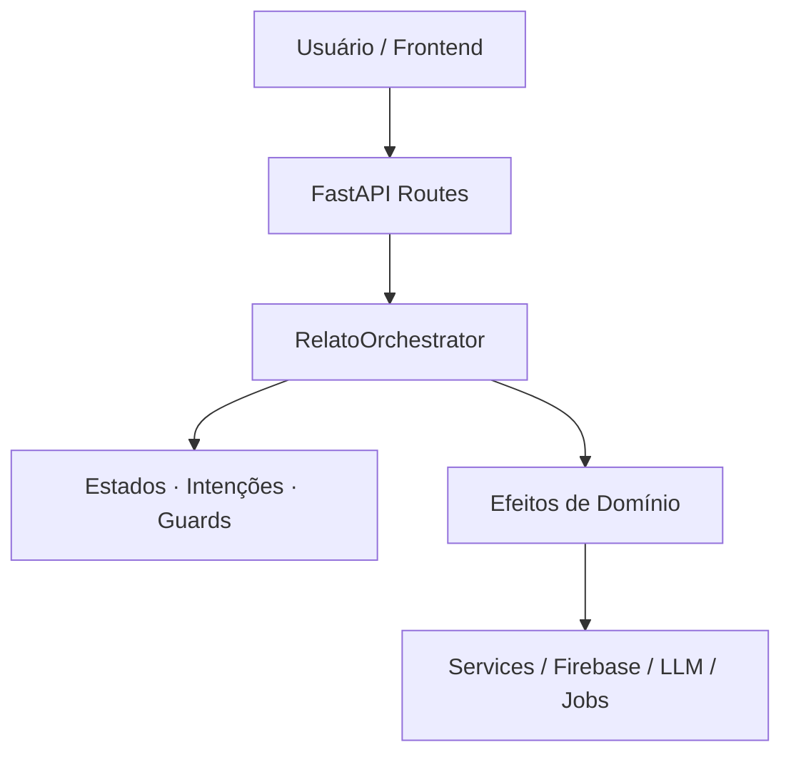
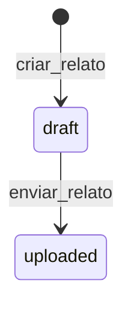

# DermaSync

A maioria dos sistemas de saúde coleta dados.  
Poucos entendem o que esses dados **significam**.

O **DermaSync** nasceu de uma pergunta simples — e desconfortável:

> *E se relatos reais de pessoas pudessem gerar conhecimento coletivo,  
sem virar exploração, vigilância ou desinformação médica?*

Este projeto não é apenas uma API com IA.  
Ele é um **sistema cognitivo de domínio** que transforma experiências humanas em estruturas computáveis, mantendo algo raro na era dos algoritmos: **controle, ética e explicabilidade**.

Aqui:
- decisões não são mágicas  
- LLMs não mandam  
- regras não ficam escondidas em `if/else`  
- e nenhum dado sensível “escapa” por conveniência

O DermaSync foi projetado para uma geração que:
- desconfia de caixas-pretas  
- valoriza transparência  
- entende que tecnologia sem critério vira ruído  
- e prefere sistemas que **explicam suas decisões**

Se você acredita que IA não deveria substituir o pensamento humano,  
mas **ampliá-lo com responsabilidade**,  
este repositório é para você.


## 📌 Princípios Fundamentais

- **O domínio decide. Os adaptadores executam.**
- Nenhuma regra de negócio vive em rotas, services ou jobs.
- LLMs são ferramentas auxiliares, **nunca oráculos de decisão**.
- Privacidade, anonimização e ética são **propriedades do sistema**, não pós-processos.
- Toda decisão importante é **testável, rastreável e explicável**.

---

## 📖 Sumário

1. Visão Geral
2. Arquitetura Cognitiva
3. Diagrama de Arquitetura (Mermaid)
4. Estrutura de Pastas
5. Modelo de Domínio (Relatos)
6. Fluxo de Relatos (end-to-end)
7. API — Rotas de Relatos
8. Pipeline de Processamento
9. Privacidade, Ética e Anonimização
10. Observabilidade e Auditoria
11. Automação de Documentação
12. Roadmap Técnico
13. Contribuição
14. Licença

---

## 1. Visão Geral

O **DermaSync** coleta relatos textuais e imagens de pessoas com dermatite atópica, processa esses dados por um pipeline estruturado (com ou sem LLMs), e gera conhecimento coletivo de forma ética, anônima e auditável.

O sistema foi projetado para:
- Evoluir sem reescrita
- Ser compreendido por engenheiros novos
- Ser defendido em ambientes técnicos exigentes
- Integrar IA **sem perder controle semântico**

---

## 2. Arquitetura Cognitiva

O sistema segue uma arquitetura em camadas bem definidas:

```
[Mundo Externo]
↓
[Adaptadores]
↓
[Orquestrador de Domínio]
↓
[Estados · Intenções · Guards]
```

### Camadas

- **Domínio**
  - Decide o que pode ou não acontecer
  - Define estados, intenções, transições e efeitos
- **Orquestrador**
  - Avalia intenções e retorna decisões formais
- **Adaptadores**
  - FastAPI, Firebase, Jobs, LLMs
  - Executam apenas o que o domínio ordena

Nenhuma camada externa decide regras de negócio.

---

## 3. Diagrama de Arquitetura (Mermaid)

<!-- AUTO:MERMAID:START -->

<!-- AUTO:MERMAID:END -->

## 4. Diagrama de Máquina de Estados (Domain)

<!-- AUTO:DOMAIN_STATE_MACHINE:START -->

<!-- AUTO:DOMAIN_STATE_MACHINE:END -->

## 5. Estrutura de Pastas
Esta seção é gerada automaticamente a partir do código-fonte.

<!-- AUTO:TREE:START -->
```text
(estrutura gerada automaticamente)
```
<!-- AUTO:TREE:END -->

## 5. Modelo de Domínio — Relatos
Local canônico: `app/domain/relato/`

**Componentes**

| Arquivo         | Responsabilidade                     |
| --------------- | ------------------------------------ |
| `states.py`     | Estados possíveis de um relato       |
| `intents.py`    | Intenções semânticas                 |
| `guards.py`     | Regras determinísticas               |
| `transitions.py`| Mapa intent → estado                 |
| `effects.py`    | Efeitos ordenáveis                   |
| `contracts.py`  | Context, Decision, Effect            |
| `orchestrator.py`| Cérebro decisório                    |


**Restrições absolutas**

O domínio:

- ❌ Não importa FastAPI
- ❌ Não acessa banco
- ❌ Não chama LLM
- ❌ Não faz IO

O domínio apenas decide.

---

## 6. Fluxo de Relatos (end-to-end)

```bash
POST /relatos
   ↓
Route (adapter)
   ↓
RelatoOrchestrator.attempt_intent(...)
   ↓
Decision(effects=[...])
   ↓
Services executam efeitos
   ↓
Relato muda de estado
```

Cada mudança de estado:

- é explícita
- é testável
- é auditável

---

## 7. Intents do projeto
<!-- AUTO:RELATO_INTENTS:START -->
| Intent | Estados de Origem | Estado(s) de Destino |
|-------|------------------|---------------------|
| `criar_relato` | Nenhum (criação) | draft |
| `enviar_relato` | draft | uploaded |
<!-- AUTO:RELATO_INTENTS:END -->


## 7. API — Rotas de Relatos
Esta seção é gerada automaticamente a partir da aplicação FastAPI.

<!-- AUTO:RELATOS_ROUTES:START -->
| Método | Rota                                  | Descrição                                                              |
| :---   | :------------------------------------ | :--------------------------------------------------------------------- |
| `POST` | `/relatos`                            | Envia um novo relato, incluindo texto e imagens (multipart/form-data). |
| `GET`  | `/relatos/{relato_id}`                | Obtém os dados completos de um relato específico.                        |
| `GET`  | `/relatos/{relato_id}/status`         | Verifica o status de processamento de um relato (e.g., `PENDING`, `PROCESSED`). |
| `GET`  | `/relatos/{relato_id}/imagens`        | Retorna as URLs das imagens associadas a um relato.                      |
| `GET`  | `/relatos/similares/{relato_id}`      | Busca relatos semanticamente similares (funcionalidade RAG).             |
| `GET`  | `/galeria/public/v3`                  | Lista os relatos públicos para exibição na galeria, com paginação.      |
<!-- AUTO:RELATOS_ROUTES:END -->

---

## 8. Pipeline de Processamento
O pipeline é modular, versionável e auditável.

**Etapas canônicas**
1. Recebimento do relato
2. Validação e persistência inicial
3. Extração de metadados (LLM opcional)
4. Anonimização determinística + contextual
5. Segmentação semântica
6. Indexação vetorial (RAG)
7. Disponibilização para consulta

Cada etapa pode:
- falhar isoladamente
- ser reprocessada
- ser auditada

---

## 9. Privacidade, Ética e Anonimização
- Consentimento explícito obrigatório
- Anonimização em duas camadas:
  - determinística (regex)
  - contextual (LLM supervisionado)
- Nenhum dado sensível é exposto publicamente
- LLMs não têm acesso direto a dados identificáveis
- Todo processamento deixa rastro de auditoria

---

## 10. Observabilidade e Auditoria
O sistema deve registrar:
- Estado anterior → estado novo
- Intenção aplicada
- Guards avaliados
- Efeitos executados
- Versão do modelo (se houver LLM)
- Timestamp e contexto mínimo

Isso permite:
- debugging semântico
- análise ética
- evolução segura

---

## 11. Automação de Documentação
Este README suporta geração automática das seguintes seções:

| Seção               | Fonte                    |
| ------------------- | ------------------------ |
| Estrutura de pastas | `extract_tree.py`        |
| Rotas de relatos    | Introspecção FastAPI     |
| Diagrama Mermaid    | Arquivo `.mmd`           |
| Datas               | Script de atualização    |


**Marcadores usados:**
- `<!-- AUTO:TREE:START -->`
- `<!-- AUTO:RELATOS_ROUTES:START -->`
- `<!-- AUTO:MERMAID:START -->`
- `<!-- AUTO:RELATO_INTENTS:START -->` 

⚠️ Nunca editar manualmente dentro desses blocos.

---

## 12. Roadmap Técnico
-  Consolidação total do domínio
-  Orquestrador único canônico
-  Effects explícitos e idempotentes
-  Jobs desacoplados
-  Documentação 100% viva
-  Auditoria formal de decisões
-  Exposição segura de RAG para usuários

---

## 13. Contribuição
- PRs pequenos e focados
- Testes obrigatórios para domínio
- Nenhuma decisão fora do domínio
- Código deve explicar por que, não só como

---

## 14. Licença
MIT © Jefferson Leandro

