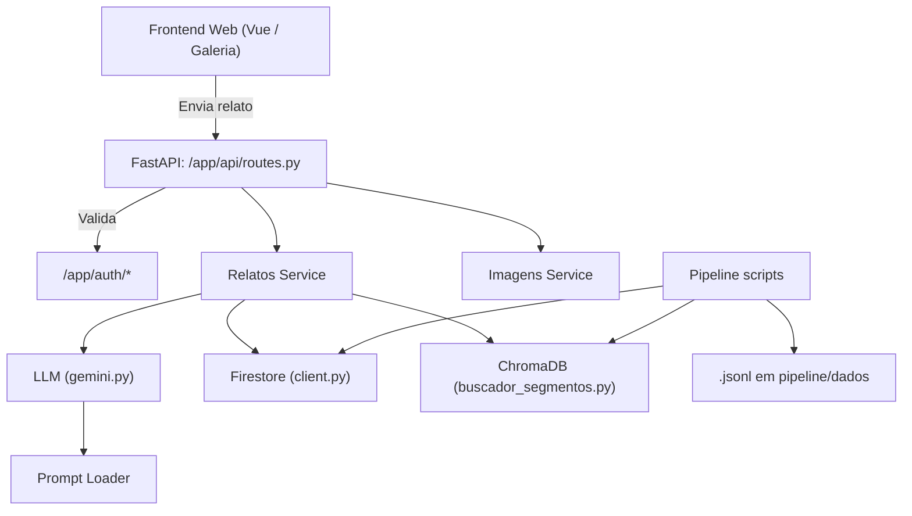
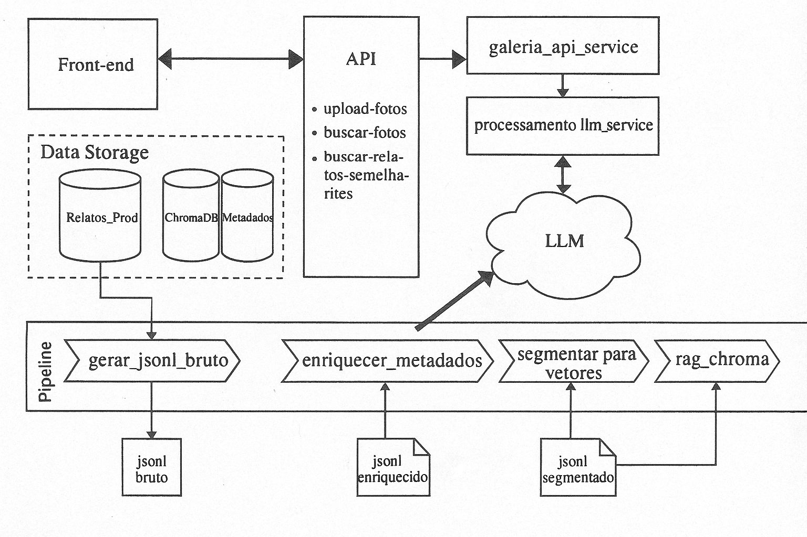

# 🌱 Projeto DermaSync


DermaSync é uma API de código aberto para auxiliar no diagnóstico e tratamento de dermatite atópica, utilizando inteligência artificial para analisar relatos de pacientes e sugerir soluções personalizadas.

## Diagrama Mermaid


## 📖 Sumário


## 🔧 Resumo Técnico

- **API**: FastAPI com rotas em `app/api`, organizadas por domínio.
- **Serviços**: Camada lógica está em `app/services` (e subpastas).
- **Integração com LLMs**: Em `app/llm`, com chamadas e prompts dinâmicos via `load_prompt`.
- **Pipeline de dados**: Com etapas modulares em `app/pipeline/scripts`.
- **ChromaDB**: Integração vetorial em `app/chroma`.
- **Firestore e Imagens**: Em `app/firestore/` e `routes/imagens.py`.
- **Deploy**: Automação com `Dockerfile`, `.bat` scripts e futura integração contínua.


## 📁 Estrutura de Pastas
```text
├── app
│   ├── api
│   │   ├── endpoints.py
│   │   ├── endpoints_videos.py
│   │   ├── routes.py
│   │   └── schemas.py
│   ├── archlog_sync
│   │   ├── exemplos
│   │   │   └── relato_log.jsonl
│   │   ├── log_parser.py
│   │   ├── logger.py
│   │   ├── mermaid_generator.py
│   │   ├── metrics.py
│   │   ├── middleware.py
│   │   ├── parser.py
│   │   └── schemas.py
│   ├── auth
│   │   ├── dependencies.py
│   │   └── schemas.py
│   ├── chroma
│   │   ├── buscador_segmentos.py
│   │   ├── buscador_tags.py
│   │   ├── factory.py
│   │   └── ingest_from_jsonl.py
│   ├── core
│   │   └── logger.py
│   ├── firestore
│   │   ├── client.py
│   │   └── persistencia.py
│   ├── llm
│   │   └── gemini.py
│   ├── pipeline
│   │   ├── a_extracao_bruta
│   │   │   └── gerar_jsonl_bruto.py
│   │   ├── B_enriquecimento
│   │   │   ├── enriquecer_metadados.py
│   │   │   ├── extrair_detalhes_terapeuticos.py
│   │   │   ├── extrair_tags_llm.py
│   │   │   └── gerar_microdepoimento.py
│   │   ├── dados
│   │   │   ├── jsonl_brutos
│   │   │   │   ├── relatos-20250529.jsonl
│   │   │   │   ├── relatos-20250608.jsonl
│   │   │   │   ├── relatos-20250609-v.jsonl
│   │   │   │   ├── relatos-20250609.jsonl
│   │   │   │   ├── relatos-20250620-facebook-v0.0.1.jsonl
│   │   │   │   └── relatos-20250620-facebook-v1.0.0.jsonl
│   │   │   ├── jsonl_enriquecidos
│   │   │   │   ├── relatos-20250620-facebook-v0.0.1.enriquecido.jsonl
│   │   │   │   ├── relatos_enriquecidos-20250529.jsonl
│   │   │   │   ├── relatos_enriquecidos-20250609-n.jsonl
│   │   │   │   ├── relatos_enriquecidos-20250609-v.jsonl
│   │   │   │   └── relatos_enriquecidos-20250609.jsonl
│   │   │   ├── segmentos
│   │   │   │   └── segmentos-20250529.jsonl
│   │   │   └── relatos_recebidos.jsonl
│   │   ├── llm_client
│   │   │   ├── base.py
│   │   │   └── gemini_client.py
│   │   ├── scripts
│   │   │   ├── _llm_client
│   │   │   │   ├── base.py
│   │   │   │   └── gemini_client.py
│   │   │   ├── 01_gerar_jsonl_bruto.py
│   │   │   ├── 02_enriquecer_metadados.py
│   │   │   ├── 03_segmentar_para_vetores.py
│   │   │   ├── 04_rag_chroma.py
│   │   │   └── corrige.py
│   │   └── data_reader.py
│   ├── routes
│   │   ├── health.py
│   │   ├── imagens.py
│   │   └── relatos.py
│   ├── schema
│   │   ├── log_entry.py
│   │   ├── relato.py
│   │   └── relato_schema.json
│   ├── services
│   │   ├── imagens_service.py
│   │   └── relatos_service.py
│   ├── config.py
│   └── logger_config.py
├── logs
│   └── structured_logs.jsonl
├── outputs
│   ├── fluxo_req_001.html
│   └── fluxo_req_001.mmd
├── scripts
│   └── visualizar_diagrama.py
├── tests
│   ├── conftest.py
│   ├── test_archlog_sync_extra.py
│   ├── test_auth.py
│   ├── test_auth_rotas.py
│   ├── test_enviar_relato.py
│   ├── test_healthcheck.py
│   ├── test_integracao_01_02.py
│   ├── test_parser_metrics.py
│   ├── test_pipeline_01_jsonlbruto.py
│   ├── test_pipeline_02_enriquecer_metadados.py
│   ├── test_relatos.py
│   ├── utils.py
│   └── validar_jsonl.py
├── .gcloudignore
├── .pylintrc
├── CHANGELOG.md
├── clean_docker_cache.bat
├── deploy_dermasync_api.bat
├── gerar_diagrama.py
├── pylint_report.txt
└── test_report.md
```

## 📜 Detalhes do Projet
# 🌱 Projeto DermaSync – Estrutura Atualizada


## 📝 Atualização do README
🕓 Última atualização automática: 05/07/2025 15:20:41
